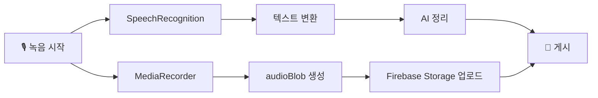

# Walkthrough: 음성 녹음 Firebase 업로드 & 코드 리팩토링

## 변경 요약

| 파일 | 변경 유형 | 설명 |
|------|-----------|------|
| [config.js](file:///d:/Workspace/CAPSTONE_2/senior-app/src/firebase/config.js) | 수정 | `getStorage` export 추가 |
| [useBoardPosts.js](file:///d:/Workspace/CAPSTONE_2/senior-app/src/hooks/useBoardPosts.js) | **신규** | 게시판 공통 훅 (로드/저장/오디오 업로드) |
| [VoiceWriter.jsx](file:///d:/Workspace/CAPSTONE_2/senior-app/src/components/VoiceWriter.jsx) | 수정 | MediaRecorder 병렬 녹음, 미리듣기 UI |
| [VoiceWriter.css](file:///d:/Workspace/CAPSTONE_2/senior-app/src/components/VoiceWriter.css) | 수정 | 녹음 인디케이터, 오디오 플레이어 스타일 |
| [BoardPage.jsx](file:///d:/Workspace/CAPSTONE_2/senior-app/src/components/BoardPage.jsx) | 수정 | 상세 화면 오디오 플레이어, 목록 🎤 배지 |
| [BoardPage.css](file:///d:/Workspace/CAPSTONE_2/senior-app/src/components/BoardPage.css) | 수정 | 오디오 섹션 스타일 |
| [FreeBoard.jsx](file:///d:/Workspace/CAPSTONE_2/senior-app/src/pages/FreeBoard.jsx) | 수정 | useBoardPosts 훅 적용 (86줄→25줄) |
| [Counseling.jsx](file:///d:/Workspace/CAPSTONE_2/senior-app/src/pages/Counseling.jsx) | 수정 | 훅 적용 + **props 버그 수정** |
| [MonthlyTopic.jsx](file:///d:/Workspace/CAPSTONE_2/senior-app/src/pages/MonthlyTopic.jsx) | 수정 | 훅 적용 + **props 누락 보완** |
| [Education.jsx](file:///d:/Workspace/CAPSTONE_2/senior-app/src/pages/Education.jsx) | 수정 | 훅 적용 + **props 누락 보완** |

---

## 주요 변경 상세

### 1. useBoardPosts 커스텀 훅

4개 게시판 페이지에서 반복되던 **~60줄의 보일러플레이트**를 하나의 훅으로 통합:

```javascript
const { posts, loading, createPost } = useBoardPosts('free');
```

**포함된 기능:**
- `orderBy('createdAt', 'desc')` 정렬 추가 (기존에 누락)
- 오디오 Blob이 있으면 자동으로 Firebase Storage에 업로드 후 `audioURL` 필드를 Firestore 문서에 저장

### 2. VoiceWriter — 실시간 녹음 기능

`SpeechRecognition`(텍스트 변환)과 `MediaRecorder`(오디오 녹음)가 **동시에 작동**합니다:



**새로 추가된 UI 요소:**
- 🔴 녹음 중 인디케이터 (빨간 점 깜빡임)
- 🔊 녹음된 음성 미리듣기 (transcript-ready, result 단계 모두)
- "게시하면 이 음성도 함께 업로드됩니다" 안내 메시지

### 3. BoardPage — 오디오 재생

- **목록**: 음성 첨부된 글에 🎤 배지 표시
- **상세**: "음성으로 작성된 글이에요" 섹션 + 네이티브 `<audio>` 플레이어

### 4. 버그 수정

| 이슈 | 수정 내용 |
|------|-----------|
| Counseling.jsx에서 "자유게시판" 표시 | → "고민상담", emoji 🤝, accentColor #f9a825 |
| MonthlyTopic.jsx props 누락 | → emoji 💬, description, accentColor #3a7d44 추가 |
| Education.jsx props 누락 | → emoji 📚, description, accentColor #c62828 추가 |
| network 에러 메시지 | → "음성 인식 서버에 연결할 수 없습니다. 잠시 후 다시 시도해주세요." |

---

## Firestore 스키마 변경

`posts` 컬렉션에 선택적 필드 추가:

```diff
 {
   title: string,
   content: string,
   author: string,
   date: string,
   views: number,
   comments: number,
   board: string,
   createdAt: Timestamp,
+  audioURL?: string  // Firebase Storage 다운로드 URL (음성 첨부 시에만)
 }
```

---

## 검증 결과
- ✅ `npm run build` 성공 (exit code 0)
- ⚠️ chunk size warning (615KB) — firebase SDK 크기로 인한 것으로, 기능에 영향 없음

## 참고사항
- Firebase Storage의 CORS 설정이 필요할 수 있습니다. 오디오 재생이 안 되면 Storage 규칙에서 읽기 권한을 확인해주세요.
- Firestore에 `orderBy('createdAt', 'desc')` 쿼리 사용 시 복합 인덱스가 필요할 수 있습니다. Firebase 콘솔에서 인덱스 생성 알림이 뜨면 클릭하여 생성해주세요.
